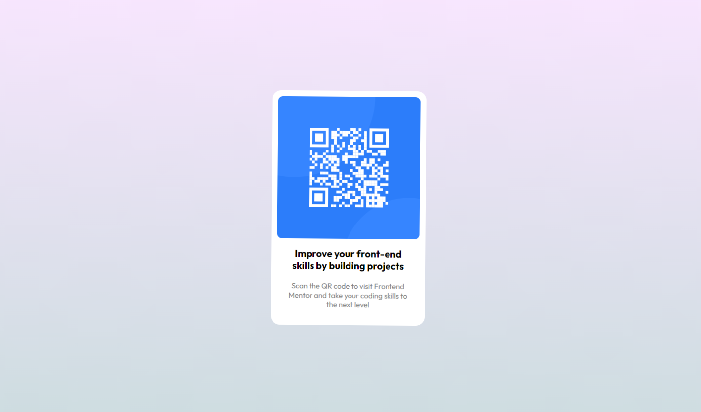

# Frontend Mentor - QR code component solution

This is a solution to the [QR code component challenge on Frontend Mentor](https://www.frontendmentor.io/challenges/qr-code-component-iux_sIO_H). Frontend Mentor challenges help you improve your coding skills by building realistic projects.

## Table of contents

- [Overview](#overview)
  - [Screenshot](#screenshot)
  - [Links](#links)
  - [Built with](#built-with)
  - [What I learned](#what-i-learned)
  - [Continued development](#continued-development)
  - [Useful resources](#useful-resources)
- [Author](#author)

**Note: Delete this note and update the table of contents based on what sections you keep.**

## Overview

Qr Code view project.
shows a card compoent with qrCode,it useful to use in large websites that contain a user profile, payment channels, etc..

### Screenshot

### Links

- Solution URL: [Add solution URL here](https://your-solution-url.com)
- Live Site URL: [Add live site URL here](https://your-live-site-url.com)

### Built with

- Semantic HTML5 markup
- CSS custom properties
- Flexbox
- Sass
- Gulp Js Toolkit
- Responsive Web Design

### What I learned

-Using Sass to style the project
-using Gulp.js to compile Sass files into css files

### Continued development

Improve using sass to build more complex project

### Useful resources

- [resource 1](https://cssgradient.io) - This helped me for choosing background gradient color .
  It very easy to use, and gives you the code of a color .
- [resource 2](https://gulpjs.com) - From this website you can learn about Gulp and how to get started.

## Author

- Frontend Mentor - [@Mr-Som3a](https://www.frontendmentor.io/profile/Mr-Som3a)
- Twitter - [@Mr_Mo_8](https://www.twitter.com/Mr_Mo_8)
- Instagram - [mr.mo98](https://www.instagram.com/mr.mo98)
